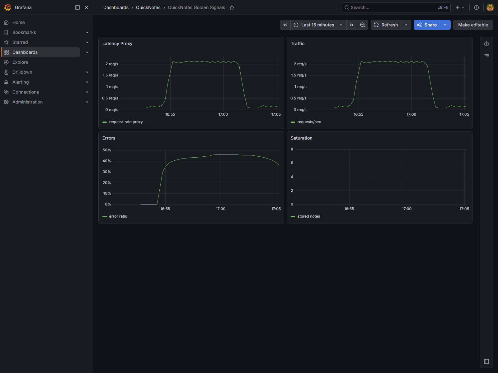
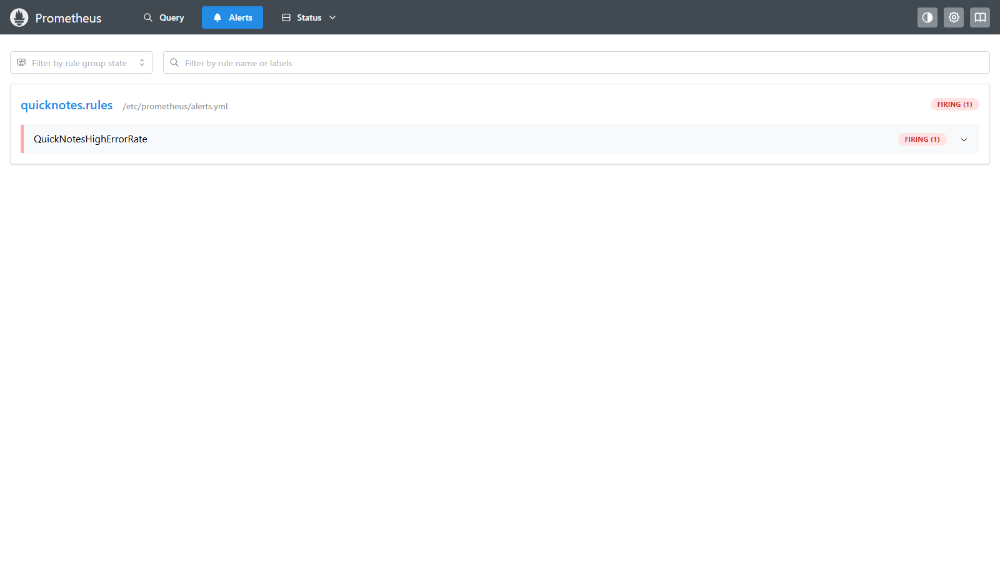

# Lab 8 - SRE and Monitoring

## Configuration

The monitoring stack is defined in these files:

- `compose.yaml` - QuickNotes, Prometheus, and Grafana services.
- `monitoring/prometheus/prometheus.yml` - 15 second scrape interval and the `quicknotes:8080` scrape target.
- `monitoring/prometheus/alerts.yml` - `QuickNotesHighErrorRate` Prometheus alert rule.
- `monitoring/grafana/provisioning/datasources/datasource.yml` - default Prometheus data source at `http://prometheus:9090`.
- `monitoring/grafana/provisioning/dashboards/dashboard.yml` - dashboard provider.
- `monitoring/grafana/dashboards/golden-signals.json` - four-panel Golden Signals dashboard.

The dashboard has these panels:

| Signal | Query |
| --- | --- |
| Latency proxy | `rate(quicknotes_http_requests_total[1m])` |
| Traffic | `rate(quicknotes_http_requests_total[1m])` |
| Errors | `sum(rate(quicknotes_http_responses_by_code_total{code=~"4..|5.."}[5m])) / clamp_min(sum(rate(quicknotes_http_requests_total[5m])), 0.001)` |
| Saturation | `quicknotes_notes_total` |

QuickNotes does not expose a request-duration histogram, so the latency panel uses the lab-approved request-rate proxy instead of a true p95 latency query.

## Verification

`docker compose ps` from the Lab 8 stack:

```text
NAME                IMAGE                    SERVICE      STATUS
lab8-grafana-1      grafana/grafana:13.0.9   grafana      Up 14 minutes
lab8-prometheus-1   prom/prometheus:v3.5.0   prometheus   Up 14 minutes
lab8-quicknotes-1   quicknotes:lab8          quicknotes   Up 14 minutes (healthy)
```

Endpoint checks:

```text
curl http://127.0.0.1:8080/health
{"notes":4,"status":"ok"}

curl http://127.0.0.1:9090/-/ready
Prometheus Server is Ready.

curl http://127.0.0.1:3000/api/health
{"database":"ok","version":"13.0.9"}
```

Prometheus target health:

```json
{
  "health": "up",
  "scrapeUrl": "http://quicknotes:8080/metrics",
  "lastError": ""
}
```

Grafana API showed the provisioned dashboard:

```text
QuickNotes Golden Signals
/d/quicknotes-golden-signals/quicknotes-golden-signals
```

Dashboard after traffic:



## Alert

The alert is defined in `monitoring/prometheus/alerts.yml`:

```yaml
- alert: QuickNotesHighErrorRate
  expr: |
    (
      sum(rate(quicknotes_http_responses_by_code_total{code=~"4..|5.."}[5m]))
      /
      clamp_min(sum(rate(quicknotes_http_requests_total[5m])), 0.001)
    ) > 0.05
  for: 5m
  labels:
    severity: page
  annotations:
    summary: "QuickNotes high HTTP error ratio"
    description: "More than 5% of QuickNotes requests have returned 4xx or 5xx responses for at least 5 minutes."
    runbook: "docs/runbook/high-error-rate.md"
```

I triggered the alert with sustained mixed traffic: one healthy `GET /health` and one malformed `POST /notes` per second for about seven minutes.

Prometheus API evidence:

```json
{
  "alertname": "QuickNotesHighErrorRate",
  "severity": "page",
  "state": "firing",
  "activeAt": "2026-09-25T13:54:27.482041068Z",
  "value": "4.607679465776294e-01"
}
```

Alert firing screenshot:



## Runbook

The runbook lives at `docs/runbook/high-error-rate.md`.

### What This Alert Means

More than 5% of QuickNotes HTTP requests have returned 4xx or 5xx responses for at least 5 minutes.

### Triage Steps

1. Open the QuickNotes Golden Signals dashboard and confirm whether the error ratio, traffic, and note count changed at the same time.
2. Check Prometheus target health for `quicknotes`; if the target is down, inspect the container with `docker compose ps` and `docker compose logs quicknotes`.
3. Look at recent request patterns and reproduce a failing request with `curl` against `/health`, `/notes`, and `POST /notes`.
4. If errors are mostly 4xx, check whether a caller is sending malformed JSON or missing required fields. If errors include 5xx, inspect `/data/notes.json` permissions and disk space.

### Mitigations

1. Roll back the latest application or configuration change and restart the `quicknotes` service.
2. If malformed client traffic is causing sustained 4xx volume, temporarily rate-limit or block the noisy source at the edge.
3. If persistence is broken, restore `/data/notes.json` from backup or move the service to a fresh named volume after preserving the bad file for analysis.

### Post-Incident

Record the timeline, customer impact, root cause, and follow-up actions using the Lecture 1 postmortem template. Add a regression test or alert refinement for the failure mode before closing the incident.

## Design Questions

### a) Pull vs push

Prometheus pulls metrics, so Prometheus must be able to reach QuickNotes on the Compose network. QuickNotes does not need to know where Prometheus is. If Prometheus cannot reach QuickNotes, the target goes down (`up == 0`), metrics stop updating, and dashboards or alerts that depend on fresh samples become stale or empty.

### b) Scrape interval tradeoffs

A 5 second interval creates many more samples and makes short-window queries noisier and more expensive; small hiccups also look more dramatic. A 5 minute interval hides short incidents, makes graphs blocky, and delays alert detection because `rate()` has too few fresh points to work with.

### c) `rate()` vs `irate()` vs `delta()`

`rate()` is the right choice for the Traffic panel because the metric is a counter and the dashboard needs a stable per-second trend over a range. `irate()` uses only the last two samples and is better for volatile, high-resolution debugging, not a calm dashboard. `delta()` reports a raw difference over the range and is a poor fit for counters because resets and range length make it harder to read as traffic.

### d) Why provision Grafana from files

File provisioning makes the dashboard reproducible, reviewable, and easy to rebuild with `docker compose up`. It also keeps dashboard changes in Git, so a fresh machine or CI environment gets the same data source and panels without manual UI clicks.

### e) Why sustained for 5 minutes

The service should not page someone for one bad request or a short client mistake. A five-minute hold-down filters small bursts and pages only when users are likely seeing a continuing problem.

### f) Symptom alerts vs cause alerts

A cause alert for QuickNotes might page on a container restart or a high disk-usage threshold. That is worse as the primary page because it can fire when users are unaffected, and it can miss other causes that still produce user-visible errors. The error-ratio alert watches the symptom users experience.

### g) Alert fatigue threshold

If more than 25% of pages for this alert have no user-visible impact or required action, I would treat it as too noisy and tune the threshold, duration, or routing.

## Bonus

I did not attempt the Checkly bonus because this lab run stayed local inside Vagrant and did not publish QuickNotes through a stable public URL for a 30 minute two-region check.
